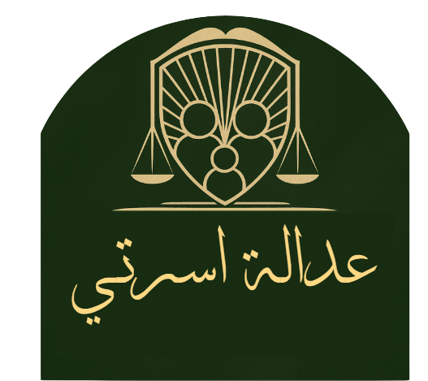
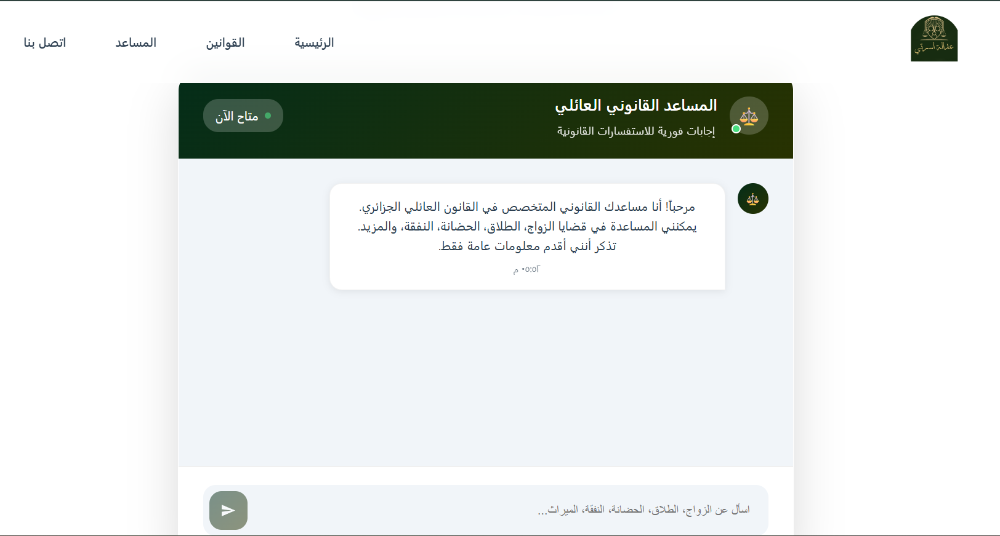
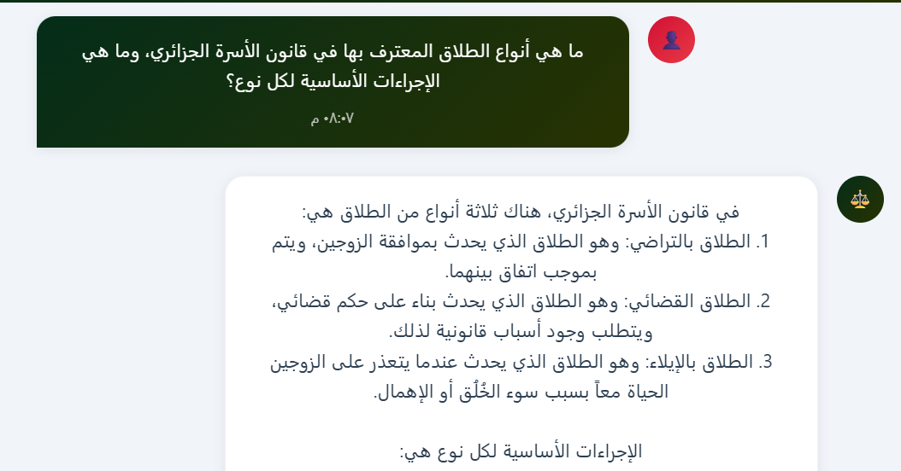

#  Ussraty

### 🇩🇿 Algerian Family Legal Assistant — RAG System

**Ussraty** is an AI-powered legal assistance platform designed to provide Algerian citizens with accessible information about **personal status and family law**.

The platform combines **Retrieval-Augmented Generation (RAG)** with Algerian legal resources to provide contextual answers to family-law questions while helping users explore relevant laws and legal articles.

>  **Disclaimer:** Ussraty provides general legal information for educational purposes only and does not replace advice from a qualified lawyer.

---

## 📸 Platform Preview

### Landing Page


### Legal Assistant



### Platform Interface



---

##  Features

*  **AI Legal Assistant** — Ask questions about Algerian family law and receive contextual answers.
*  **Law Explorer** — Browse relevant laws and legal articles.
*  **RAG-based Retrieval** — Retrieve relevant legal information before generating an answer.
*  **Consultation Requests** — Submit a detailed legal inquiry through the platform.
*  **Legal Resources & Statistics** — Access information about available legal resources.
*  **Algerian Legal Context** — Focused on personal status and family law in Algeria.

---

## 🏛️ Main Legal Services

###  Marriage & Contracts

Information related to:

* Marriage conditions
* Marriage contracts
* Rights and obligations of spouses
* Dowry regulations

###  Divorce & Khula

Information related to:

* Divorce procedures
* Khula
* Financial rights
* Legal consequences of divorce

###  Custody & Child Care

Information related to:

* Child custody
* Child support
* Parental visitation
* Relevant court rulings

###  Alimony & Financial Rights

Information related to:

* Alimony obligations
* Financial rights
* Claim procedures
* Relevant legal provisions

---

## 📜 Algerian Family Law

Ussraty provides access to key areas of Algerian family legislation, including:

| Legal Area       |       Articles | Topics                                     |
| ---------------- | -------------: | ------------------------------------------ |
| 💍 Marriage      |  Articles 4–10 | Marriage conditions and requirements       |
| ⚖️ Divorce       | Articles 48–58 | Types of divorce, procedures, and effects  |
| 👨‍👩‍👧 Custody | Articles 62–74 | Custody requirements and children's rights |
| 💰 Alimony       | Articles 75–83 | Financial obligations and claims           |

> The platform is designed to help users locate and understand relevant legal provisions through a conversational interface.

---

## 🤖 Intelligent Legal Assistant

The **Ussraty Legal Assistant** allows users to ask questions in natural language and receive answers based on the platform's legal knowledge base.

### Example Questions

* What are the conditions for marriage in Algeria?
* What are the rights of a divorced woman?
* How is child custody determined?
* What are the conditions for Khula?
* Who is responsible for child support?

The RAG architecture retrieves relevant legal information and uses it as context when generating the response.

---

## 🧠 RAG Architecture

Ussraty follows a **Retrieval-Augmented Generation (RAG)** approach:

```text
User Question
      │
      ▼
┌──────────────────┐
│  Legal Assistant │
└────────┬─────────┘
         │
         ▼
┌──────────────────┐
│  Query Retrieval │
└────────┬─────────┘
         │
         ▼
┌──────────────────┐
│ Legal Knowledge  │
│      Base        │
└────────┬─────────┘
         │
         ▼
┌──────────────────┐
│ Relevant Legal   │
│    Context       │
└────────┬─────────┘
         │
         ▼
┌──────────────────┐
│   LLM Response   │
└────────┬─────────┘
         │
         ▼
    User Answer
```

This approach helps ground generated responses in retrieved legal information rather than relying only on the language model's general knowledge.

---

## 📊 Platform Statistics

* **500+** referenced cases
* **50+** legal articles
* **24/7** assistant availability

---

## 📝 Submit a Consultation

Users can submit a consultation request by providing:

* **Full Name**
* **Email**
* **Consultation Type**
* **Details of the Inquiry**

The submitted information can then be used to facilitate further legal assistance.

---

## 🌐 About Ussraty

**Ussraty** is a legal-tech platform focused on making Algerian family law more accessible and understandable to citizens.

The project combines **Artificial Intelligence, Retrieval-Augmented Generation, and legal knowledge resources** to create an accessible conversational legal assistant.

###  Goal

The goal of Ussraty is to help users:

* Understand their legal rights
* Find relevant family-law provisions
* Navigate common legal questions
* Access legal information through a simple conversational interface


---

## Legal Disclaimer

Ussraty is an **informational and educational tool**.

The information provided by the platform should not be considered professional legal advice. Users should consult a qualified legal professional for advice regarding their specific situation.

---

## 🔗 Quick Links

* 🏠 Home
* 🏛️ Services
* 📜 Laws
* 🤖 Legal Assistant
* 📚 Resources
* 📝 Consultation
